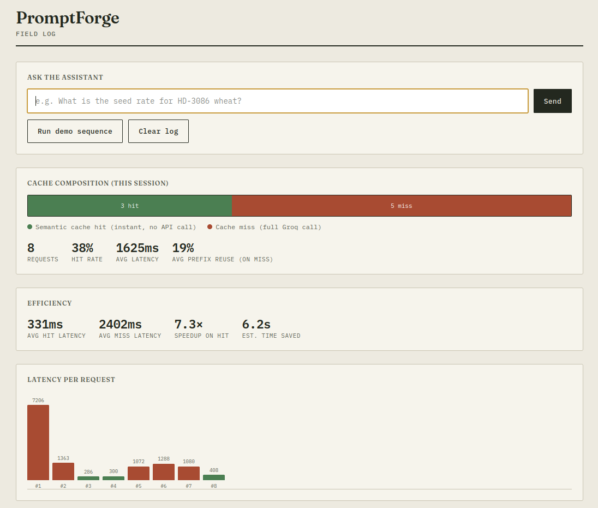
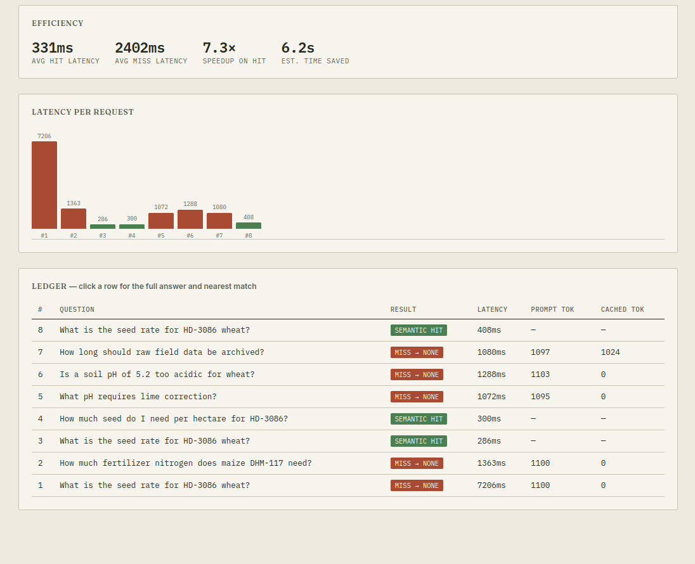
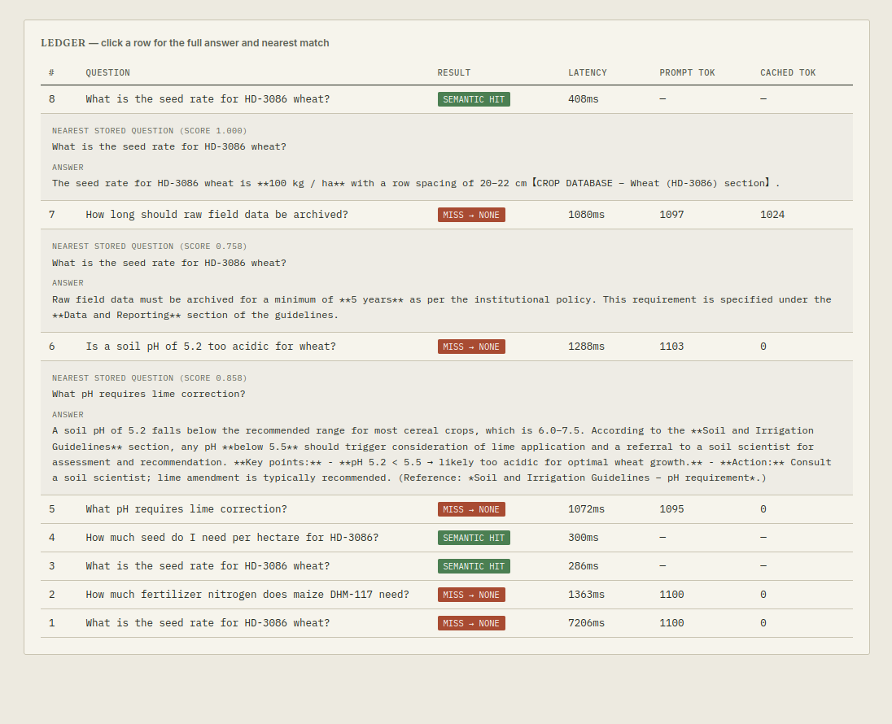

# PromptForge

An LLM caching gateway for an agri-research assistant — combining naive, prefix, and semantic caching strategies behind one interface, benchmarked with adversarial test cases, and hardened after finding (and fixing) a real correctness bug.

## The problem

LLM applications with a long, static system prompt (product catalogs, policy documents, domain knowledge) resend that entire prompt on every request, even when the user's question is one they've effectively already asked — just phrased differently. This project measures three approaches to avoiding that waste, from naive to production-grade, on a simulated internal tool for an agricultural research team.

## Demo


*The live dashboard — ask a question, or run the built-in demo sequence to see cache hits and misses populate in real time.*


*Hit vs. miss latency compared directly — this session shows a 7.3× speedup on cache hits and ~6.2s of estimated time saved.*


*Every request is logged with its full answer and, on both hits and misses, the nearest stored question it matched against — including the similarity score.*
## Tech stack

FastAPI · Groq (`openai/gpt-oss-20b`, prompt-caching enabled) · Hugging Face Inference Providers (embeddings) · FAISS · Pydantic / pydantic-settings · pytest

## Project structure

```
promptforge/
├── app/
├── docs/
│   ├── main.py              # FastAPI entrypoint — /chat, /health, /meta
│   ├── config.py             # validated settings from .env
│   ├── models.py             # request/response schemas
│   ├── prompts.py            # agri-research system prompt
│   ├── embeddings.py          # HF embedding client wrapper
│   ├── static/index.html      # live dashboard
│   └── cache/
│       ├── base.py            # abstract Cache interface
│       ├── naive.py           # exact-match cache
│       ├── prefix.py          # Groq prefix-cache stats tracker
│       └── semantic.py        # FAISS + embeddings + numeric guard
├── benchmarks/
│   ├── queries.py             # adversarial benchmark query set
│   ├── run_benchmark.py       # single-run harness (3 strategies)
│   └── run_multi_trial.py     # multi-trial statistical runner
├── tests/
│   ├── test_naive_cache.py
│   └── test_semantic_cache.py # includes numeric-guard regression tests
├── .env.example
└── requirements.txt
```

## Setup

```bash
python -m venv .venv
source .venv/bin/activate
pip install -r requirements.txt
cp .env.example .env
```

Add your keys to `.env`:
- `GROQ_API_KEY` — free at [console.groq.com/keys](https://console.groq.com/keys)
- `HF_TOKEN` — free at [huggingface.co/settings/tokens](https://huggingface.co/settings/tokens)

## Running it

```bash
# Run the API + dashboard
uvicorn app.main:app --reload
# → open http://127.0.0.1:8000/

# Run the fast, offline unit tests (no API calls, no keys needed)
python -m pytest -v

# Run a single benchmark pass across all 3 strategies (real API calls)
python -m benchmarks.run_benchmark

# Run the statistically-averaged benchmark (3 trials by default)
python -m benchmarks.run_multi_trial --trials 3
```